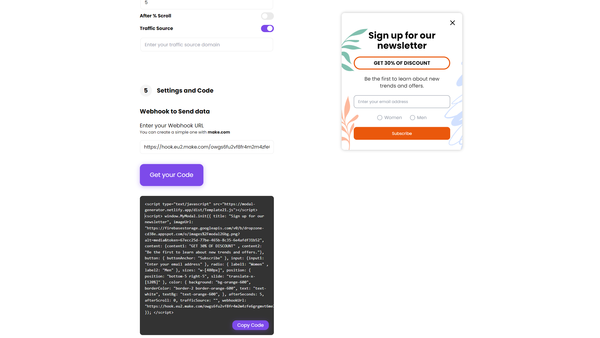

# Modal Generator

Welcome to **Modal Generator** – a simple and powerful tool for creating and customizing modals effortlessly! This project uses modern web technologies to give users a smooth and easy way to build, configure, and embed modals on any website. Below is a quick overview of the project, its features, and how you can use it to create your own modals.

## 🌐 Live Demo

Check out the live version of the site here: [Live Demo Link](https://modal-generator.netlify.app/)

## 🖼️ Project Screenshot



## 🛠️ Technologies Used

- **Next.js** – React-based framework for building user interfaces.
- **TypeScript** – For type-safe development and scalable code.
- **SASS** – CSS preprocessor for better styling management.
- **Webpack** – To bundle and convert .tsx files into JavaScript.
- **Firebase** – For handling image uploads and retrieving URLs.
- **Webhook URL** – Integrate external services via webhooks to track interactions.

## 🎯 What Does This Project Do?

The Modal Generator allows users to select from a wide range of modal templates and fully customize them according to their preferences. Once a user configures the modal, the system converts it from a TypeScript component into JavaScript using Webpack. The final result is an embed code, which users can copy and paste into their own websites. This makes the generated modal ready to use immediately.

## 🚀 How It Works

1. **Select a Template:**  
   Users can browse through a variety of **modal templates** and pick one that best suits their needs.

2. **Customize Appearance:**  
   In the **Appearance** section, users can modify:

- **Size:** Adjust modal dimensions.
- **Color:** Change background, border and text colors.
- **Position:** Define where the modal appears on the screen (e.g., top-left, center).
- **Image:** If the selected modal includes images or logos, users can upload them. These images are automatically stored in Firebase, and their URLs are embedded directly into the code.

3. **Add Content:**  
   Users can modify or delete the content inside the modal. This includes titles, text, button, input, radio and any other visible elements.

4. **Configure Targeting Rules:**  
   In this section, users define when and where the modal should appear:

- **Device Type:** Choose between mobile, desktop, or both.
- **After X Seconds:** Set the modal to trigger after a specific time delay.
- **After % Scroll:** Trigger the modal when the user scrolls a certain percentage of the page.
- **Traffic Source Domain:** Configure the modal to display only for visitors from specific domains.

5. **Add Webhook URL:** In the final step, users can integrate a **webhook URL** (e.g., from Make.com) to track user interactions with the modal. This enables detailed analytics, such as:

- Button clicks.
- Form input variables.
- Device type, operating system, browser laguage and name, and date.

6. **Generate Embed Code:**  
   Once the modal is configured, the user clicks the **"Get Embed Code"** button. The system generates a JavaScript embed code that the user can copy and paste just above the **body** tag on their website.

## 📦 Example Embed Code

```bash
<script type="text/javascript" src="https://modal-generator.netlify.app//dist/Template21.js"></script> <script> window.MyModal.init({ title: "Sign up for our newsletter", imageUrl: "https://firebasestorage.googleapis.com/v0/b/dropzone-cd38e.appspot.com/o/images%2Fmodal26bg.png?alt=media&token=67ecc25d-77be-465b-8c35-6e4afdf31b52", content: {content1: "GET 30% OF DISCOUNT" , content2: "Be the first to learn about new trends and offers."}, button: { buttonAnchor: "Subscribe" }, input: {input1: "Enter your email address" }, radio: { label1: "Women" , label2: "Men" }, sizes: "w-[480px]", position: { position: "bottom-5 right-5", slide: "translate-x-[120%]" }, color: { background: "bg-violet-600", borderColor: "border-2 border-violet-600", text: "text-white", }, device: "hidden sm:flex", afterSeconds: 5, afterScroll: 30, trafficSource: "", webhookUrl: "https://hook.eu2.make.com/owgs6fu2vf8fr4m2m4zfe6gvt6me7", }); </script>
```

Simply paste this code into your website, and your modal will be ready to use!

<!-- 🎥 Demo Video -->

## 📈 Benefits of Using This Project

- **Seamless Customization:** Full control over appearance, content, and behavior.
- **Easy Integration:** Just copy-paste the embed code to any website.
- **Analytics & Tracking:** Get insights via webhook URL on user interactions.
- **Dynamic Behavior:** Target specific devices and control when the modal appears.

---

Thank you for using Modal Generator! 🎉
